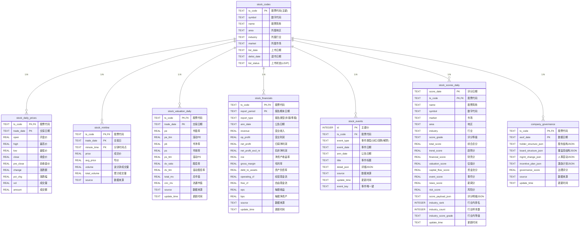
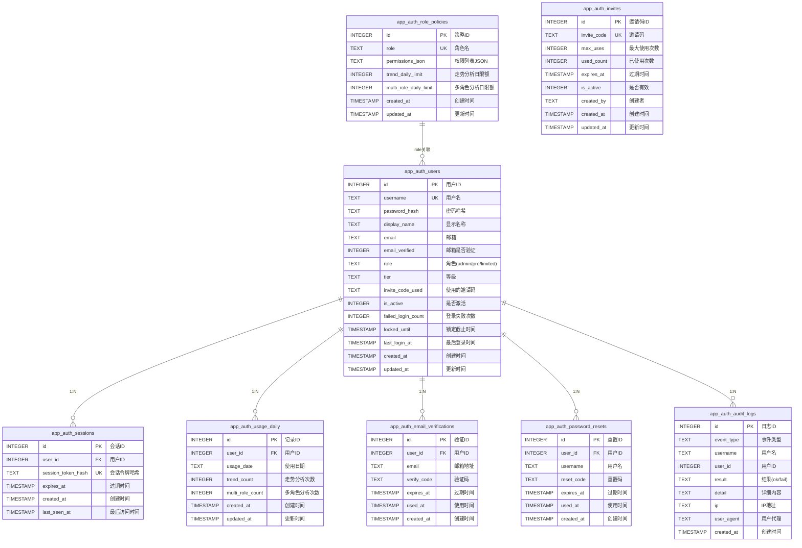
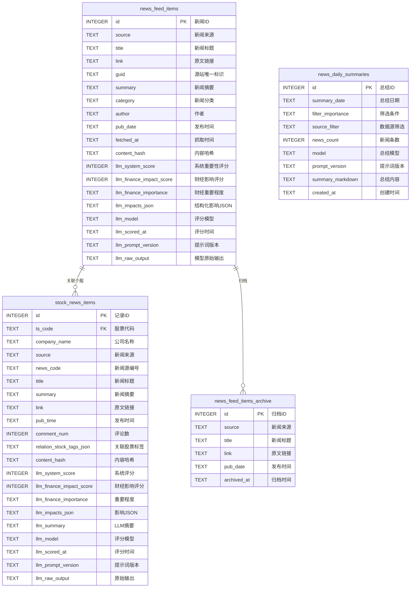
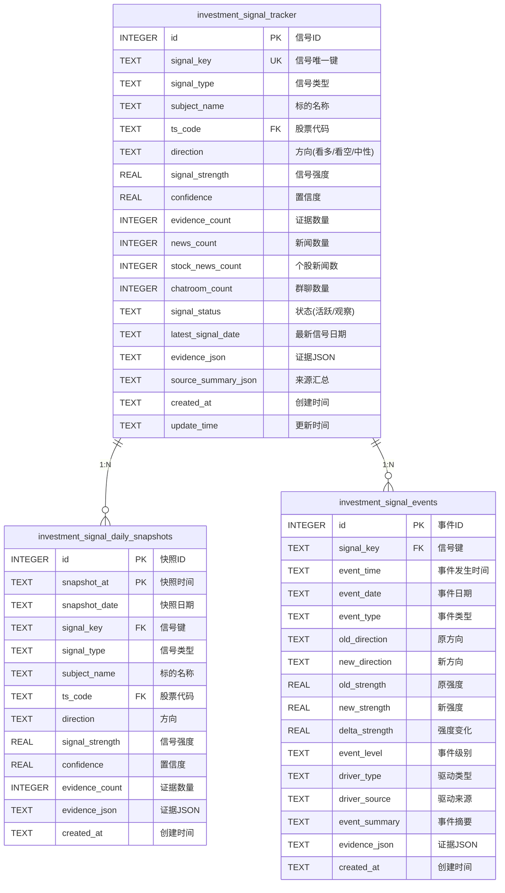
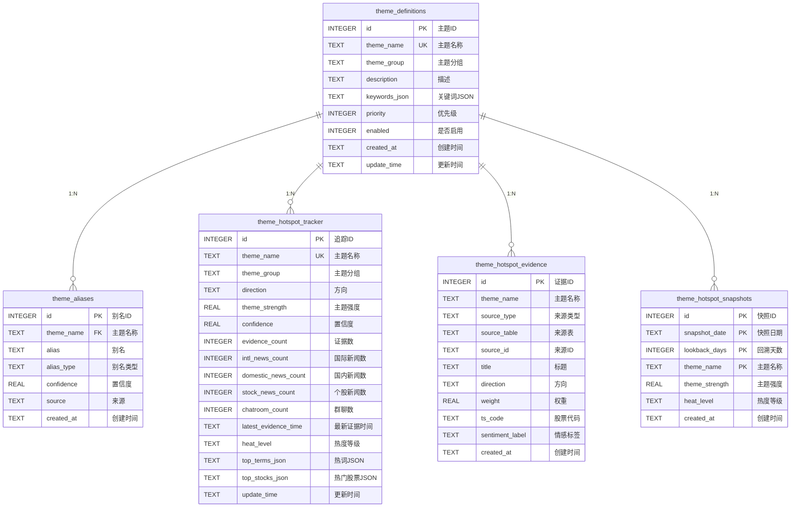
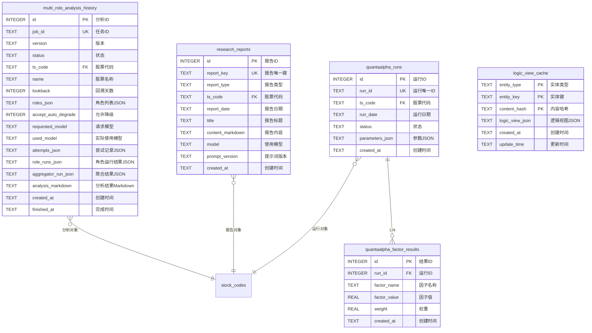
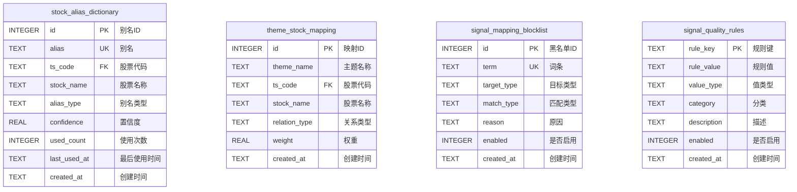

# Zanbo Quant 数据库 ER 图

> **生成时间**: 2026-04-05  
> **数据库**: PostgreSQL 主库  
> **表数量**: 40+ 张表

---

## 一、ER 图总览（按模块划分）

```mermaid
erDiagram
    %% ==================== 核心股票数据模块 ====================
    stock_codes ||--o{ stock_daily_prices : "1:N"
    stock_codes ||--o{ stock_minline : "1:N"
    stock_codes ||--o{ stock_valuation_daily : "1:N"
    stock_codes ||--o{ stock_financials : "1:N"
    stock_codes ||--o{ stock_events : "1:N"
    stock_codes ||--o{ stock_scores_daily : "1:N"
    stock_codes ||--o{ stock_news_items : "1:N"
    stock_codes ||--o{ company_governance : "1:N"
    stock_codes ||--o{ capital_flow_stock : "1:N"
    stock_codes ||--o{ risk_scenarios : "1:N"
    stock_codes ||--o{ theme_stock_mapping : "1:N"
    stock_codes ||--o{ stock_alias_dictionary : "1:N"
    stock_codes ||--o| investment_signal_tracker : "1:0..1"
    stock_codes ||--o{ investment_signal_daily_snapshots : "1:N"
    
    %% ==================== 用户认证模块 ====================
    app_auth_users ||--o{ app_auth_sessions : "1:N"
    app_auth_users ||--o{ app_auth_usage_daily : "1:N"
    app_auth_users ||--o{ app_auth_email_verifications : "1:N"
    app_auth_users ||--o{ app_auth_password_resets : "1:N"
    app_auth_users ||--o{ app_auth_audit_logs : "1:N"
    app_auth_role_policies ||--o{ app_auth_users : "1:N (role)"
    
    %% ==================== 新闻模块 ====================
    news_feed_items ||--o{ stock_news_items : "源新闻:个股关联"
    news_feed_items ||--o{ news_feed_items_archive : "归档"
    
    %% ==================== 群聊舆情模块 ====================
    chatroom_list_items ||--o{ wechat_chatlog_clean_items : "1:N"
    chatroom_list_items ||--o{ chatroom_investment_analysis : "1:N"
    wechat_chatlog_clean_items ||--o{ chatroom_investment_analysis : "来源消息"
    chatroom_investment_analysis ||--o{ chatroom_stock_candidate_pool : "聚合生成"
    
    %% ==================== 投资信号模块 ====================
    investment_signal_tracker ||--o{ investment_signal_daily_snapshots : "1:N"
    investment_signal_tracker ||--o{ investment_signal_events : "1:N"
    
    %% ==================== 主题热点模块 ====================
    theme_definitions ||--o{ theme_aliases : "1:N"
    theme_definitions ||--o{ theme_hotspot_tracker : "1:N"
    theme_definitions ||--o{ theme_hotspot_evidence : "1:N"
    theme_definitions ||--o{ theme_hotspot_snapshots : "1:N"
    theme_stock_mapping }o--|| theme_definitions : "N:1"
    
    %% ==================== 宏观数据模块 ====================
    macro_series ||--o{ rate_curve_points : "无直接关联"
    fx_daily ||--o{ spread_daily : "衍生计算"
    
    %% ==================== 研究模块 ====================
    stock_codes ||--o{ multi_role_analysis_history : "1:N"
    stock_codes ||--o{ research_reports : "1:N"
    stock_codes ||--o{ quantaalpha_runs : "1:N"
    stock_codes ||--o{ quantaalpha_factor_results : "1:N"
```



---

## 二、核心股票数据模块

### 2.1 股票主表与行情数据



---

## 三、用户认证与权限模块



---

## 四、新闻与资讯模块



---

## 五、群聊舆情模块

```mermaid
erDiagram
    chatroom_list_items {
        TEXT room_id PK "群聊唯一ID"
        TEXT remark "群备注名"
        TEXT nick_name "群昵称"
        TEXT owner "群主标识"
        INTEGER user_count "成员数量"
        TEXT source_url "来源接口"
        TEXT first_seen_at "首次发现时间"
        TEXT last_seen_at "最后出现时间"
        INTEGER skip_realtime_monitor "是否跳过监控"
        TEXT skip_realtime_reason "跳过原因"
        TEXT last_message_date "最近消息日期"
        TEXT last_chatlog_backfill_at "最近补抓时间"
        INTEGER last_30d_raw_message_count "30天原始消息数"
        INTEGER last_30d_clean_message_count "30天清洗消息数"
        TEXT llm_chatroom_summary "群聊简介"
        TEXT llm_chatroom_tags_json "分类标签"
        TEXT llm_chatroom_primary_category "主分类"
        TEXT llm_chatroom_activity_level "活跃度等级"
        TEXT llm_chatroom_risk_level "风险等级"
        INTEGER llm_chatroom_confidence "分类置信度"
        TEXT llm_chatroom_tagged_at "标签时间"
    }
    
    wechat_chatlog_clean_items {
        INTEGER id PK "消息ID"
        TEXT talker FK "群聊名称"
        TEXT query_date_start "查询起始日期"
        TEXT query_date_end "查询结束日期"
        TEXT message_date "消息日期"
        TEXT message_time "消息时间"
        TEXT sender_name "发送人昵称"
        TEXT sender_id "发送人ID"
        TEXT message_type "消息类型"
        TEXT content "原始内容"
        TEXT content_clean "清洗后内容"
        INTEGER is_quote "是否引用"
        TEXT quote_sender_name "被引用发送人"
        TEXT quote_content "被引用内容"
        TEXT message_key "消息唯一键"
        TEXT fetched_at "抓取时间"
    }
    
    chatroom_investment_analysis {
        INTEGER id PK "分析ID"
        TEXT room_id FK "群聊ID"
        TEXT talker "群聊名称"
        TEXT analysis_date "分析日期"
        INTEGER analysis_window_days "分析窗口天数"
        INTEGER message_count "消息条数"
        INTEGER sender_count "发言人数"
        TEXT latest_message_date "最新消息日期"
        TEXT room_summary "群聊摘要"
        TEXT targets_json "投资标的JSON"
        TEXT final_bias "投资倾向(看多/看空)"
        TEXT model "使用模型"
        TEXT prompt_version "提示词版本"
        TEXT raw_output "原始输出"
        TEXT created_at "创建时间"
    }
    
    chatroom_stock_candidate_pool {
        INTEGER id PK "候选ID"
        TEXT candidate_name "候选标的名称"
        TEXT candidate_type "候选类型"
        INTEGER bullish_room_count "看多群数"
        INTEGER bearish_room_count "看空群数"
        INTEGER net_score "净分值"
        TEXT dominant_bias "主导方向"
        INTEGER mention_count "提及次数"
        INTEGER room_count "涉及群数"
        TEXT latest_analysis_date "最近分析日期"
        TEXT sample_reasons_json "样例理由JSON"
        TEXT source_room_ids_json "来源群ID列表"
        TEXT created_at "创建时间"
    }
    
    chatroom_list_items ||--o{ wechat_chatlog_clean_items : "1:N"
    chatroom_list_items ||--o{ chatroom_investment_analysis : "1:N"
    wechat_chatlog_clean_items ||--o{ chatroom_investment_analysis : "来源"
    chatroom_investment_analysis ||--o{ chatroom_stock_candidate_pool : "聚合"
```



---

## 六、投资信号模块



---

## 七、主题热点模块



---

## 八、宏观与资金模块

```mermaid
erDiagram
    macro_series {
        TEXT indicator_code PK "指标代码"
        TEXT indicator_name "指标名称"
        TEXT freq PK "频率(D/W/M/Q/Y)"
        TEXT period PK "统计周期"
        REAL value "指标值"
        TEXT unit "单位"
        TEXT source "数据来源"
        TEXT publish_date "发布日期"
        TEXT update_time "更新时间"
    }
    
    rate_curve_points {
        TEXT market PK "市场(CN/US)"
        TEXT curve_code PK "曲线代码"
        TEXT trade_date PK "交易日期"
        TEXT tenor PK "期限(1M/3M/10Y)"
        REAL value "点位值"
        TEXT unit "单位"
        TEXT source "数据来源"
        TEXT update_time "更新时间"
    }
    
    fx_daily {
        TEXT pair_code PK "汇率对代码"
        TEXT trade_date PK "交易日期"
        REAL open "开盘价"
        REAL high "最高价"
        REAL low "最低价"
        REAL close "收盘价"
        REAL pct_chg "涨跌幅"
        TEXT source "数据来源"
        TEXT update_time "更新时间"
    }
    
    spread_daily {
        TEXT spread_code PK "利差代码"
        TEXT trade_date PK "交易日期"
        REAL value "利差值"
        TEXT unit "单位(bp)"
        TEXT source "数据来源"
        TEXT update_time "更新时间"
    }
    
    capital_flow_market {
        TEXT trade_date PK "交易日期"
        TEXT flow_type PK "资金流向类型"
        REAL net_inflow "净流入金额"
        REAL buy_amount "买入金额"
        REAL sell_amount "卖出金额"
        TEXT unit "单位"
        TEXT source "数据来源"
    }
    
    capital_flow_stock {
        TEXT ts_code PK,FK "股票代码"
        TEXT trade_date PK "交易日期"
        REAL net_inflow "净流入"
        REAL main_inflow "主力资金净流入"
        REAL super_large_inflow "超大单净流入"
        REAL large_inflow "大单净流入"
        REAL medium_inflow "中单净流入"
        REAL small_inflow "小单净流入"
        TEXT update_time "更新时间"
    }
    
    risk_scenarios {
        INTEGER id PK "场景ID"
        TEXT ts_code FK "股票代码"
        TEXT scenario_date "情景日期"
        TEXT scenario_name "情景名称"
        TEXT horizon "观察期限"
        REAL pnl_impact "盈亏影响"
        REAL max_drawdown "最大回撤"
        REAL var_95 "95% VaR"
        REAL cvar_95 "95% CVaR"
        TEXT assumptions_json "假设JSON"
        TEXT update_time "更新时间"
    }
```



---

## 九、研究工具模块



---

## 十、辅助数据表



---

## 十一、表统计信息

| 模块 | 表名 | 当前行数 | 说明 |
|------|------|----------|------|
| **股票核心** | stock_codes | 5,814 | 股票基础信息主表 |
| | stock_daily_prices | 1,327,993 | 日线行情 |
| | stock_minline | 1,757,145 | 分钟线数据 |
| | stock_valuation_daily | 125,985 | 估值日频 |
| | stock_financials | 17,631 | 财务指标 |
| | stock_events | 128,529 | 股票事件 |
| | stock_scores_daily | 16,479 | 综合评分 |
| | company_governance | 2,744 | 公司治理 |
| **新闻** | news_feed_items | 6,740 | 财经快讯 |
| | news_feed_items_archive | 50 | 新闻归档 |
| | news_daily_summaries | 3 | 日报总结 |
| | stock_news_items | 554 | 个股新闻 |
| **群聊** | chatroom_list_items | 166 | 群聊列表 |
| | wechat_chatlog_clean_items | 320,945 | 清洗消息 |
| | chatroom_investment_analysis | 27 | 投资倾向分析 |
| | chatroom_stock_candidate_pool | 176 | 候选池 |
| **宏观资金** | macro_series | 35,329 | 宏观指标 |
| | fx_daily | 1,565 | 汇率日线 |
| | rate_curve_points | 188 | 利率曲线 |
| | spread_daily | 47 | 利差数据 |
| | capital_flow_market | 476 | 市场资金流 |
| | capital_flow_stock | 1,256,146 | 个股资金流 |
| | risk_scenarios | 27,425 | 风险场景 |

---

## 十二、关键关系说明

### 12.1 核心关联关系

```
┌─────────────────────────────────────────────────────────────────┐
│                        核心关联关系                              │
├─────────────────────────────────────────────────────────────────┤
│                                                                 │
│  stock_codes (主表)                                             │
│       │                                                         │
│       ├──► stock_daily_prices (1:N) 日线行情                    │
│       ├──► stock_minline (1:N) 分钟线                           │
│       ├──► stock_valuation_daily (1:N) 估值数据                 │
│       ├──► stock_financials (1:N) 财务数据                      │
│       ├──► stock_events (1:N) 股票事件                          │
│       ├──► stock_scores_daily (1:N) 综合评分                    │
│       ├──► capital_flow_stock (1:N) 个股资金流                  │
│       ├──► stock_news_items (1:N) 个股新闻                      │
│       ├──► company_governance (1:N) 公司治理                    │
│       ├──► risk_scenarios (1:N) 风险场景                        │
│       └──► investment_signal_tracker (1:0..1) 投资信号          │
│                                                                 │
└─────────────────────────────────────────────────────────────────┘
```

### 12.2 投资信号数据流

```
┌─────────────────────────────────────────────────────────────────┐
│                      投资信号数据流                              │
├─────────────────────────────────────────────────────────────────┤
│                                                                 │
│  新闻/群聊数据                                                   │
│       │                                                         │
│       ▼                                                         │
│  investment_signal_tracker (当前信号状态)                       │
│       │                                                         │
│       ├──► investment_signal_daily_snapshots (历史快照)         │
│       └──► investment_signal_events (状态变更事件)              │
│                                                                 │
└─────────────────────────────────────────────────────────────────┘
```

### 12.3 用户认证数据流

```
┌─────────────────────────────────────────────────────────────────┐
│                       用户认证数据流                             │
├─────────────────────────────────────────────────────────────────┤
│                                                                 │
│  app_auth_users (用户主表)                                      │
│       │                                                         │
│       ├──► app_auth_sessions (登录会话)                         │
│       ├──► app_auth_usage_daily (日使用统计)                    │
│       ├──► app_auth_email_verifications (邮箱验证)              │
│       ├──► app_auth_password_resets (密码重置)                  │
│       └──► app_auth_audit_logs (审计日志)                       │
│                                                                 │
│  app_auth_role_policies (角色策略) ◄───── 角色关联              │
│                                                                 │
└─────────────────────────────────────────────────────────────────┘
```

---

**文档结束**

---

> 💡 **说明**: 
> - 本 ER 图基于 2026-04-05 的数据库结构生成
> - 表行数来源于 `docs/database_dictionary.md`
> - 表关系基于外键约束和业务逻辑推导
