# Zanbo Quant 当前系统 ER 图（2026-04-05）

> 目的：给前端联调、测试回归、接口排障提供统一的数据关系视图。  
> 说明：图中关系分两类  
> - `||--o{`：结构上明确存在主从关系（含建表脚本中的外键或稳定主键约束）  
> - `..` 注释关系：业务逻辑关联（字段关联/聚合来源），不一定有数据库外键约束

```mermaid
erDiagram
    STOCK_CODES {
      text ts_code PK
      text symbol
      text name
      text industry
      text market
    }

    STOCK_DAILY_PRICES {
      text ts_code
      text trade_date
    }
    STOCK_MINLINE {
      text ts_code
      text trade_date
      text minute_time
    }
    STOCK_VALUATION_DAILY {
      text ts_code FK
      text trade_date
    }
    STOCK_FINANCIALS {
      text ts_code FK
      text report_period
    }
    STOCK_EVENTS {
      int id PK
      text ts_code FK
      text event_date
    }
    COMPANY_GOVERNANCE {
      text ts_code FK
      text asof_date
    }
    CAPITAL_FLOW_STOCK {
      text ts_code FK
      text trade_date
    }
    STOCK_SCORES_DAILY {
      text score_date
      text ts_code FK
    }
    STOCK_NEWS_ITEMS {
      int id PK
      text ts_code FK
      text pub_time
    }
    RISK_SCENARIOS {
      int id PK
      text ts_code FK
      text scenario_date
    }

    CAPITAL_FLOW_MARKET {
      text trade_date
      text flow_type
    }
    MACRO_SERIES {
      text indicator_code
      text freq
      text period
    }
    FX_DAILY {
      text pair_code
      text trade_date
    }
    RATE_CURVE_POINTS {
      text market
      text curve_code
      text trade_date
      text tenor
    }
    SPREAD_DAILY {
      text spread_code
      text trade_date
    }

    NEWS_FEED_ITEMS {
      int id PK
      text source
      text pub_date
      int llm_system_score
    }
    NEWS_FEED_ITEMS_ARCHIVE {
      int id
      text source
      text pub_date
      text archived_at
    }
    NEWS_DAILY_SUMMARIES {
      int id PK
      text summary_date
      text model
    }

    CHATROOM_LIST_ITEMS {
      text room_id PK
      text remark
      text nick_name
    }
    WECHAT_CHATLOG_CLEAN_ITEMS {
      int id PK
      text talker
      text message_date
      text message_key
    }
    CHATROOM_INVESTMENT_ANALYSIS {
      int id PK
      text room_id
      text analysis_date
      text final_bias
    }
    CHATROOM_STOCK_CANDIDATE_POOL {
      int id PK
      text candidate_name
      text latest_analysis_date
    }

    INVESTMENT_SIGNAL_TRACKER {
      int id PK
      text signal_key UK
      text ts_code FK
      text latest_signal_date
    }
    INVESTMENT_SIGNAL_TRACKER_7D {
      int id PK
      text signal_key UK
      text ts_code
    }
    INVESTMENT_SIGNAL_TRACKER_1D {
      int id PK
      text signal_key UK
      text ts_code
    }
    INVESTMENT_SIGNAL_DAILY_SNAPSHOTS {
      int id PK
      text snapshot_at
      text signal_key
      text ts_code FK
    }
    INVESTMENT_SIGNAL_EVENTS {
      int id PK
      text signal_key
      text event_time
      text event_type
    }

    THEME_STOCK_MAPPING {
      int id PK
      text theme_name
      text ts_code FK
    }
    STOCK_ALIAS_DICTIONARY {
      int id PK
      text alias UK
      text ts_code FK
    }
    SIGNAL_MAPPING_BLOCKLIST {
      int id PK
      text term
      text target_type
    }
    SIGNAL_QUALITY_RULES {
      text rule_key PK
      text category
    }

    STOCK_CODES ||--o{ STOCK_VALUATION_DAILY : ts_code
    STOCK_CODES ||--o{ STOCK_FINANCIALS : ts_code
    STOCK_CODES ||--o{ STOCK_EVENTS : ts_code
    STOCK_CODES ||--o{ COMPANY_GOVERNANCE : ts_code
    STOCK_CODES ||--o{ CAPITAL_FLOW_STOCK : ts_code
    STOCK_CODES ||--o{ STOCK_SCORES_DAILY : ts_code
    STOCK_CODES ||--o{ STOCK_NEWS_ITEMS : ts_code
    STOCK_CODES ||--o{ RISK_SCENARIOS : ts_code
    STOCK_CODES ||--o{ INVESTMENT_SIGNAL_TRACKER : ts_code
    STOCK_CODES ||--o{ INVESTMENT_SIGNAL_DAILY_SNAPSHOTS : ts_code
    STOCK_CODES ||--o{ THEME_STOCK_MAPPING : ts_code
    STOCK_CODES ||--o{ STOCK_ALIAS_DICTIONARY : ts_code

    STOCK_CODES ||--o{ STOCK_DAILY_PRICES : logical_ts_code
    STOCK_CODES ||--o{ STOCK_MINLINE : logical_ts_code

    NEWS_FEED_ITEMS ||--o{ NEWS_FEED_ITEMS_ARCHIVE : archived_from
    NEWS_FEED_ITEMS ||--o{ NEWS_DAILY_SUMMARIES : daily_aggregation
    NEWS_FEED_ITEMS ||--o{ STOCK_NEWS_ITEMS : stock_mapping

    CHATROOM_LIST_ITEMS ||--o{ CHATROOM_INVESTMENT_ANALYSIS : room_id
    CHATROOM_LIST_ITEMS ||--o{ WECHAT_CHATLOG_CLEAN_ITEMS : talker_or_alias
    CHATROOM_INVESTMENT_ANALYSIS ||--o{ CHATROOM_STOCK_CANDIDATE_POOL : pooled_candidates

    INVESTMENT_SIGNAL_TRACKER ||--o{ INVESTMENT_SIGNAL_DAILY_SNAPSHOTS : signal_key
    INVESTMENT_SIGNAL_TRACKER ||--o{ INVESTMENT_SIGNAL_EVENTS : signal_key
    INVESTMENT_SIGNAL_TRACKER ||--o{ INVESTMENT_SIGNAL_TRACKER_7D : derived_window
    INVESTMENT_SIGNAL_TRACKER ||--o{ INVESTMENT_SIGNAL_TRACKER_1D : derived_window

    THEME_STOCK_MAPPING ||--o{ INVESTMENT_SIGNAL_TRACKER : theme_to_signal
    STOCK_ALIAS_DICTIONARY ||--o{ INVESTMENT_SIGNAL_TRACKER : alias_resolve
    SIGNAL_MAPPING_BLOCKLIST ||--o{ INVESTMENT_SIGNAL_TRACKER : mapping_guard
    SIGNAL_QUALITY_RULES ||--o{ INVESTMENT_SIGNAL_TRACKER : quality_gate
```

## 数据来源与口径

- 表清单与字段：`docs/database_dictionary.md`（2026-03-27 导出）
- 外键关系：`create_research_tables.py` 已声明的 `FOREIGN KEY`
- 信号窗口表（`investment_signal_tracker_7d / 1d`）：`backend/server.py`、`job_registry.py` 运行链路

## 使用建议（前端/测试）

- 页面联调先按主链实体走：`stock_codes -> (行情/估值/财务/事件/评分/个股新闻)`。
- 新闻链问题先看：`news_feed_items -> (stock_news_items, news_daily_summaries, archive)`。
- 信号链问题先看：`investment_signal_tracker -> (snapshots, events)`，再看 `7d/1d` 派生表是否更新。
